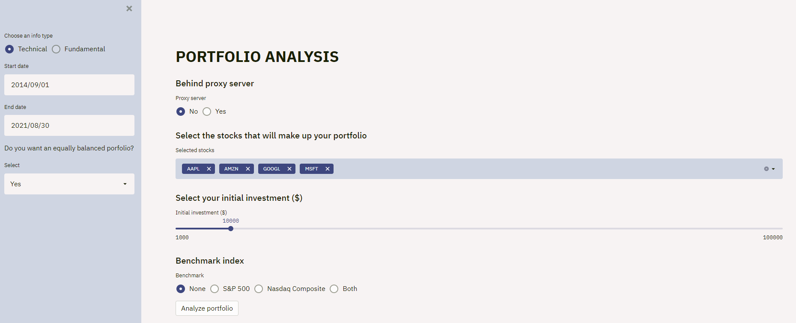

# Stock Portfolio Analyzer

Simple app to evaluate the past performance of a portfolio.



<p align="center">
<a href="https://stock-portfolio-analyzer.herokuapp.com/" target="blank">
    
</a>  

## Usage

0. Install [anaconda](https://www.anaconda.com/products/individual).

1. Create a virtual environment:

```bash
conda create -n env_stock_portfolio_analyzer python=3.7
conda activate env_stock_portfolio_analyzer
```
2. Clone this repository

```bash
git clone https://github.com/jmonsalverodilla/Stock-Portfolio-Analyzer.git
cd Stock-Portfolio-Analyzer
```

3. Install requirements:

```bash
pip install -r requirements.txt
```

4. Run the app:

```bash
streamlit run stock_portfolio_analyzer.py --server.runOnSave True
```

## License

This repo is under the [MIT License](LICENSE).